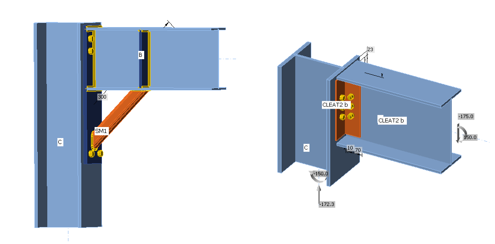

**Status:** 👷‍♂️ Work In Progress. Have a question relating to the topic? Please add an issue.

## Beams
This data extends the properties of Design Members in the Structural Model for the purpose of designing a Connection. You can specify:
* Whether a beam is a Structural Member (loaded) or an Added Member (part of a Connection design, e.g. Cleats used to bolt Structural Members together)
* That a given Beam is Bearing, meaning that supports will be added in the model of the Connection
* Whether a beam is negative, meaning that it is only used to generate cuts and cut-outs on the other Beams

### Added Members

Added Members are additional structural items that relate to a particular connection. Some examples are stiffening members or angle cleats.



Although typically relating to a single connection, added Members are references to Member1D's in the Open Model. Therefore, they need to be defined and added to the OpenModel as a Member1D (I.e by defining start/endpoints, LCS, and cross-section).

Once defined in the OpenModel, added members can be added to a specific connection ConnectionData as [Beam Data](https://github.com/idea-statica/ideastatica-public/blob/main/src/IdeaRS.OpenModel/Connection/ConnectionData.cs) with the `IsAddedMember` property set to `true. The members should also be added to the ConnectionPoint `ConnectedMembers` list as well.

The example below shows how the set the BeamData of an added member.

```csharp
public static void Example_AddAddedMember(OpenModel openModel, int openModelMemberId)
{
    //Reference Data Connection that has been defined in the OpenModel
    ConnectionData connectionData = openModel.Connections[0];

    BeamData addedMemberData = new BeamData();

    //Set the beam data as an Added Member
    addedMemberData.IsAdded = true;

    //Reference previously created Member1D in the openModel
    addedMemberData.AddedMember = new ReferenceElement(openModel.Member1D.FirstOrDefault(x => x.Id == openModelMemberId));

    //Set Beam Data Id
    addedMemberData.Id = connectionData.Beams.Count +  1;

    connectionData.Beams.Add(addedMemberData);
}
```

## Negative Volumes
WiP

## Plates

Plates can now be defined using [`Region2D`](https://github.com/idea-statica/ideastatica-public/blob/main/src/IdeaRS.OpenModel/Geometry/Geometry2D/Region2D.cs) property.

**Defining plates using an SVG string property is now obsolete.** 

## Cuts
WiP

## Welds
WiP

## Bolt Grids
WiP

## Anchors
WiP

## Concrete Blocks
WiP

